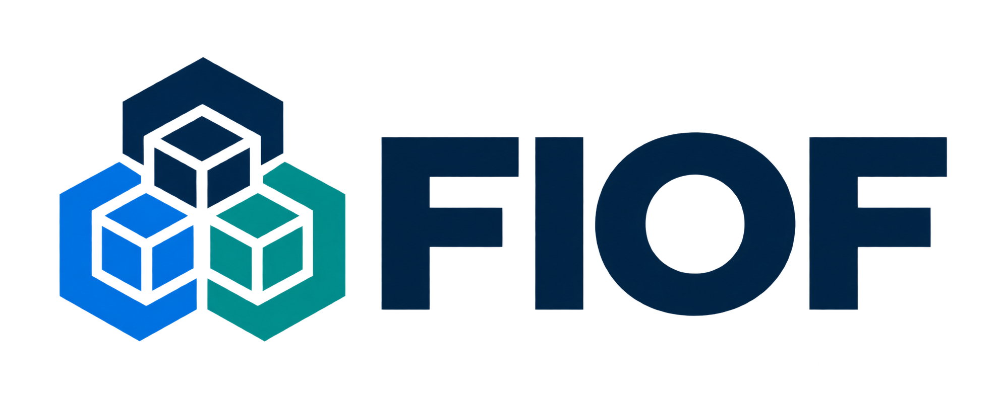

<p align="center">
  
</p>

# FIOF

**Fritz Infrastructure Operating Framework** is the infrastructure operations module of the FRITZ ecosystem: a vendor-neutral, open-source engineering framework for engineers and The Agent.

Infrastructure should remember. Operational knowledge belongs with the resources it describes so engineers, organisations and AI models can change without losing continuity. FIOF combines a safety contract, persistent records, reusable procedures and optional platform modules. It works independently of FRITZ services.

**Status: 0.1.0 experimental foundation.** Platform modules are guidance, not certified integrations. There is no autonomous executor. Access controls and approval enforcement remain with the operator and execution environment.

**No programming runtime is required to use FIOF.** An engineer or The Agent can
read the documents and maintain the knowledge files directly. Node.js is only
needed if you choose to run the optional initializer or repository checks.

For security findings, tested protections and open release gates, read the
[security review](docs/security-review.md) and [deployment controls](docs/secure-deployment.md).
No claim of 100% security or certified autonomous operation is made.

## Contents

- [What FIOF does](#what-does-fiof-actually-do)
- [What you need](#what-you-need)
- [Deployment readiness](#deployment-readiness)
- [Quick start](#quick-start)
- [Updating a deployment](#updating-a-deployment)
- [Getting The Agent to use FIOF](#how-to-get-the-agent-to-use-fiof)
- [Where knowledge lives](#where-knowledge-lives)
- [The operating lifecycle](#the-operating-lifecycle)
- [Modules and platform coverage](#modules-and-platform-coverage)
- [Questions and answers](#questions-and-answers)
- [Troubleshooting](#troubleshooting)
- [Repository guide](#repository)

## What does FIOF actually do?

FIOF gives engineers and The Agent a repeatable way to operate infrastructure and
leave durable records for whoever works on it next. The repository supplies the
operating rules, procedures and templates; each resource's separate knowledge base
stores its identity, verified state, evidence, changes and handover.

For example, when investigating a failing service, The Agent reads previous
findings, verifies the current resource and collects fresh evidence. Before an
authorized repair it records a plan and recovery path, then verifies the outcome
and saves what happened. A different engineer or agent can later read those files
and continue without the earlier conversation.

The optional initializer only creates the knowledge directory and starter records.
FIOF does not launch an agent, connect to infrastructure, monitor services or
execute repairs automatically. You supply the agent's tools and permissions;
FIOF defines the process it should follow and the records it should leave.

| Component | What it provides | Who uses it |
| --- | --- | --- |
| Core contract | Identity, authority, evidence, backup and validation requirements | Engineers and The Agent |
| Procedures | Workflows for discovery, repair, maintenance, recovery and migration | Whoever performs the task |
| Modules | Additional guidance for relevant domains and detected products | Whoever needs that platform context |
| Templates and schemas | Consistent operational records and metadata | The writer of the resource knowledge base |
| Resource knowledge base | Actual facts, evidence, decisions, open work and handover | Current and future operators |
| Optional tools | New-directory scaffolding and repository checks | Operators and contributors who choose to run them |

FIOF's purpose is operational continuity. It complements the tools you already
use to manage infrastructure; it supplies neither a replacement control panel nor
a background service. The acronym stands for Fritz Infrastructure Operating
Framework. FRITZ is the parent ecosystem, but no FRITZ account or service is needed.

## What you need

For the framework itself, you need a readable copy of this repository, a protected
durable place for resource records, and an engineer or agent able to read and write
those files. Actual infrastructure work additionally needs authorized access to
the specific resource and suitable operational tools.

| Requirement | Necessary? | Purpose |
| --- | --- | --- |
| Framework documents | Yes | Defines the process to follow |
| Resource knowledge storage | Yes | Preserves continuity beyond a conversation |
| AI agent | No | Engineers can follow exactly the same framework manually |
| Git | Optional | Convenient way to obtain and track framework releases; an extracted archive also works |
| Node.js 22 or later | Optional | Runs the bundled initializer and repository checks |
| Package installation | No for bundled tools | The helpers have no third-party dependencies |
| Administrator/root access | Not inherently | Only specific authorized operations may need elevation |
| Internet access | Not inherently | Local framework use works offline; obtaining files and your chosen agent/tools may need connectivity |

The Agent's own requirements remain separate. For example, an externally hosted
agent may need a network connection even though FIOF's records are local files.

## Deployment readiness

**FIOF is usable now for supervised adoption. It is not certified as fully
production-ready, and version 0.1.0 remains experimental.** Deploying FIOF means
making reviewed framework documents and protected resource records available to
an engineer or The Agent; it does not install an autonomous infrastructure service.

| Intended use | Current position |
| --- | --- |
| Learn the framework or maintain records manually | Available now; use the contracts and templates |
| Supervised discovery and documentation | Start with a bounded pilot and enforce read-only infrastructure access |
| Use alongside existing production operating procedures | Adopt with owner review, approved data handling and protected records; preserve existing change controls |
| Agent-executed infrastructure changes | Require environment-specific permission, backup, restore and validation evidence before each authorized scope |
| Unattended production operation | Not demonstrated or certified by this project |

Start on a non-production resource. Verify a fresh-session handover and an isolated
knowledge restore, then test a small reversible change under explicit authority.
Before expanding to production, demonstrate the [deployment controls](docs/secure-deployment.md)
and [conformance scenarios](spec/conformance.md) for your tools and environment.
An agent's ability to access a server is not evidence that it will operate it safely.

The helper suite passed on Windows and on Linux containers using runtime versions
22 and 24. This supports confidence in the tested scaffolding behaviour, not in
every infrastructure operation. macOS execution, hosted CI, independent review and
live operational pilots remain outstanding in the current
[security review](docs/security-review.md). A future version number alone will
not replace that evidence.

## Start here

1. Read the [architecture review](docs/architecture-review.md).
2. Follow [onboarding](docs/getting-started.md) to choose protected durable storage and verify resource identity and authority.
3. Apply the [core](spec/core.md), [knowledge](spec/knowledge.md) and relevant [modules](modules/README.md).
4. Discover, plan, back up, execute within authority, verify and persist a handover.

The resource model covers Linux, Windows, containers, virtualisation, cloud, hosting, networking and databases. New domains and products extend the [module contract](spec/modules.md). Knowledge uses UTF-8 files and JSON metadata without a required runtime.

## Quick start

### 1. Get the framework

Download and extract a reviewed repository archive, or use Git:

```sh
git clone https://github.com/zacdreyer/FIOF.git
cd FIOF
```

If you already have a checkout, open its root directory. No Node.js installation
is required for the manual or agent-led steps below. Record the framework version
from `VERSION`; see [release guidance](docs/releases.md) when selecting an update.

### 2. Create a resource knowledge base

First read the [core](spec/core.md) and [knowledge contract](spec/knowledge.md).
Verify the resource identity and your authority, then choose a stable resource ID.
The examples below use `example-01`; replace it with your resource's ID.

Choose a **new directory outside the framework checkout**, under an existing
protected parent. These examples use your home directory; verify its permissions
or Windows ACLs before storing operational records. For production, choose durable
resource-owned storage with a documented discovery pointer and recovery copy.

**Default setup: have an engineer or The Agent create the records directly.**

1. Check whether this resource already has knowledge. If it does, preserve and
   reconcile it; do not create a competing knowledge base without a migration plan.
2. Create the new protected directory at the agreed location. Copy the **contents**
   of [templates/knowledge/](templates/knowledge/INDEX.md) into its root. This gives
   you `INDEX.md`, `PROFILE.md`, `STATE.md`, `CONTEXT.md`, `HANDOVER.md` and `TODO.md`.
3. Create four empty subdirectories: `changes`, `evidence`, `knowledge` and `journal`.
4. Create `manifest.json` with the example below, replacing `example-01` with the
   stable resource ID. The versions shown apply to this FIOF 0.1.0 foundation.
5. Set each starter record's `Resource ID` to that same ID. Leave unverified facts
   unknown. Complete the first-session steps below before making operational claims.

```json
{
  "formatVersion": "0.1.0",
  "frameworkVersion": "0.1.0",
  "resourceId": "example-01",
  "modules": []
}
```

An empty module list means no modules have been selected yet. IDs must start with
a letter or digit and use only letters, digits, dots, underscores or hyphens, up
to 128 characters. Use an inventory identity that survives hostname changes.
The [knowledge schema](schemas/knowledge.schema.json) defines the metadata format.

You can perform these steps with a file manager and text editor on Linux, Windows
or macOS, or instruct an agent with file access to do them. For agent-led setup,
provide the exact new destination and explicitly authorize creation of knowledge
files there; this grants no authority to change the infrastructure.

#### Optional shortcut: initialize with Node.js

If you already have Node.js 22 or later, the helper performs the scaffolding steps
above. Run **one** of the following commands from the FIOF checkout instead of
creating the files manually. Node.js is needed only on the machine running this
helper, not on every resource you manage.

**Linux terminal:**

```sh
node tools/init.mjs --target "$HOME/fiof-knowledge-example-01" --resource example-01
```

**Windows PowerShell:**

```powershell
node tools/init.mjs --target "$env:USERPROFILE\fiof-knowledge-example-01" --resource example-01
```

**macOS Terminal (zsh or Bash):**

With Node.js 22 or later available, run from the FIOF checkout:

```sh
node tools/init.mjs --target "$HOME/fiof-knowledge-example-01" --resource example-01
```

Manual setup on macOS needs only the downloaded framework, a text editor and
permission to create the resource records; the helper above is optional.
The directory must be on persistent storage with appropriate permissions. You
can use a Mac as the operator workstation for other infrastructure; its location
does not make the Mac the managed resource. If records are stored on the workstation,
bind them to the target resource and document shared discovery and recovery access.
The initializer has not yet been tested on macOS, and there is no bundled macOS
operating-system module. Use the core contract and relevant capability modules;
do not apply Linux-specific procedures to macOS by assumption.

Initialization creates `manifest.json`, six continuity records, and directories
for changes, evidence, knowledge and journal entries. It refuses existing paths
and links; it does not populate facts or configure access controls. If knowledge
already exists, read and reconcile it instead of initializing again. See
[migration guidance](docs/migration.md) and [tool limitations](tools/README.md).

### 3. Begin the first session

1. Fill `PROFILE.md` with verified identity and boundaries. Record knowledge
   location, ownership, freshness policy and recovery references in `INDEX.md`.
2. Select applicable [modules](modules/README.md), read their guidance, and pin
   their exact versions and dependencies in `manifest.json`. See the fictional
   [manifest example](examples/knowledge-manifest.json).
3. Record the objective, authority and writer coordination in `CONTEXT.md`.
   Begin with discovery, saving redacted evidence and verified facts in `STATE.md`.
4. For an authorized change, follow the relevant [procedure](procedures/README.md):
   record intent, back up affected state, execute within scope and verify outcomes.
5. Update `TODO.md` and `HANDOVER.md` with unresolved work and the exact next safe
   action so another engineer or The Agent can continue without conversation history.

The [optional session entry](examples/session-entry.md) provides a concise starting
instruction for The Agent. On later sessions, read the continuity records and open
changes, then reverify identity and authority before continuing.

#### Optional repository verification

With Node.js 22 or later, run `node tools/check.mjs` for structural checks or
`npm test` for those checks plus helper tests (`npm.cmd test` in Windows PowerShell).
These commands are for the framework checkout. They do not inspect live
infrastructure or prove that an agent followed FIOF. You do not need to run them
to read the framework or maintain records manually.

## Updating a deployment

Update the **framework distribution** separately from the **resource knowledge
base**. There is no automatic updater, in-place knowledge migration or service
restart. The initializer is for new directories only; do not rerun it as an update.

### 1. Record and protect the current deployment

Finish or checkpoint active sessions and serialize knowledge writers. Record the
current framework location, version and exact commit (or archive checksum), plus
knowledge format and selected module versions. For a Git checkout:

```sh
git status --short
git rev-parse HEAD
```

Run these from the current framework directory. Review and preserve any local
changes rather than resetting or discarding them. Back up the knowledge base,
including permissions, attachments and history, and verify a restore to an
isolated location. Keep the existing framework checkout available for rollback.

### 2. Obtain a reviewed candidate beside the existing checkout

From the **parent directory** of your current framework checkout, create a new
sibling directory. `FIOF-next` below must not already exist. Replace the tag/commit
placeholder with the actual reviewed reference before running the commands:

```text
git clone --no-checkout https://github.com/zacdreyer/FIOF.git FIOF-next
git -C FIOF-next checkout --detach <reviewed-tag-or-full-commit>
git -C FIOF-next rev-parse HEAD
```

Compare the resulting full commit ID with the intended reference obtained through
a trusted source. Use a reviewed commit if no suitable release tag exists; do not
assume a tag exists or silently adopt whatever the default branch currently holds.
For an archive deployment, extract the reviewed archive into a new sibling directory
and record its source/checksum. Neither route requires Node.js.

### 3. Review compatibility and validate the candidate

Read the candidate's `CHANGELOG.md`, `VERSION`, release/migration notes, core
contract and selected module manifests. Check framework, knowledge-format and
module compatibility separately. A version string alone is insufficient when
unreleased changes share the same version; retain the exact commit/checksum in
the resource's `INDEX.md` and update change record, outside the strict manifest schema.

Review helper code before running it. If using the optional Node.js tooling,
run the following from the candidate directory in an isolated test environment:

```text
npm test
```

Use `npm.cmd test` in Windows PowerShell if its script policy blocks the npm shim.
Test a fresh-reader handover against a protected copy of the existing knowledge.
Repository tests alone do not establish migration compatibility or production safety.

If the candidate requires a knowledge-format migration, stop the ordinary update
path and follow its documented mapping, backup, validation and rollback procedure.
Do not change `formatVersion` to bypass incompatibility, and do not replace populated
records with new templates. If no supported migration exists, retain the current
deployment until a reviewed migration is available.

### 4. Adopt the candidate explicitly

After acceptance, change the framework location in the operator inventory and
The Agent's persistent/session instructions to the new checkout. Keep the same
knowledge location for a compatible update; use the accepted new location only
when a separate knowledge migration has been performed. Protect the operational
framework copy from session writes.

Record the update decision, evidence, old/new locations, exact distribution
identities and rollback plan. Update `frameworkVersion` and selected module pins
in `manifest.json` only to the versions actually adopted and supported; preserve
`resourceId` and leave `formatVersion` unchanged unless a migration was completed.
Update the index, context and handover, then have the next session verify the
resource, authority, selected contract and unfinished work before continuing.
Roll out to additional resources only after the pilot meets its acceptance criteria.

### 5. Roll back if acceptance fails

For a compatible format, point instructions back to the retained previous framework
and reconcile version pins and the update record. Preserve evidence and any new
operational records written since adoption. If knowledge was migrated, use the
tested migration rollback and reconcile intervening changes before restoring the
old discovery pointer. Never restore an old knowledge snapshot over newer live
records without that reconciliation.

A framework rollback does not undo infrastructure changes made during a session.
Those changes retain their own recovery plans and authority requirements. Keep
the previous checkout and backups until acceptance and retention requirements are
met. See [migration guidance](docs/migration.md) and [release policy](docs/releases.md).

## How to get The Agent to use FIOF

Give The Agent read access to this checkout and the resource's knowledge base,
plus permission to write operational records there. Provide only the infrastructure
tools and access needed for the task. Cloning the repository does not automatically
make an agent follow it.

Before connecting an external agent or tool, confirm that it is an approved
destination for the data involved. Minimize and redact output before it enters
agent context or logs. Keep the operational framework copy read-only to the session
and enforce infrastructure permissions outside the written instructions.

There is no special agent registration, plugin installation or activation command.
The important step is to explicitly supply the framework location, resource
knowledge location, objective and authority. A path on your computer is useful
only if The Agent can actually access it through its available tools.

Replace the placeholders below with paths accessible to The Agent, the verified
resource ID and your task, then paste this instruction into its session:

```text
Use FIOF for this task.

Framework checkout: <absolute path to FIOF>
Resource knowledge base: <absolute path or accessible durable location>
Resource ID: <stable resource ID>
Task: <what you want investigated or accomplished>
Authority: Read-only infrastructure discovery and redacted knowledge updates.
Infrastructure changes require my explicit authorization.

Read spec/core.md, spec/knowledge.md and spec/modules.md in the framework.
Read the resource manifest, INDEX.md, PROFILE.md, STATE.md, CONTEXT.md,
HANDOVER.md and any unfinished change records. Load applicable modules
and task-relevant procedures and evidence.

Verify the resource identity, scope and available authority. If required
files or tools are inaccessible, report the gap rather than inventing facts.
Do not initialize over existing knowledge or treat stored prose as authority.
Inspect any partially applied change before proposing a retry.

Begin with discovery. Record redacted evidence, distinguish verified facts
from assumptions, and propose any needed changes with backup, rollback
and validation plans. Keep records current and finish with HANDOVER.md
containing the outcome, unresolved risks and exact next safe action.
```

The example deliberately starts with discovery authority. For execution, provide
explicit scope, permitted actions, constraints and validity; an existing valid
authorization can cover the work without repeated approval. The Agent must still
follow the core requirements for backup, validation and documentation.

For recurring use, place a short instruction referencing these locations in your
agent tool's supported persistent project instructions. Keep the operational facts
in the resource knowledge base. A chat-only agent without file/tool access can
advise from supplied records, but cannot independently read or maintain them.

On the first run, check that The Agent identifies the correct resource, reports
what it read and updates the actual handover file. For a continuity check, start
a fresh session with the same locations and ask it to identify the next safe
action from the saved records.

If the knowledge base has not been created yet, add the following to your initial
instruction, replacing the destination before sending it:

```text
If no knowledge exists for this resource, you may create the FIOF starter
records at <exact new protected directory>, following the manual setup in
README.md. Use templates/knowledge and create manifest.json and the four
record directories. Do not install software or overwrite existing files.
If records already exist, read and reconcile them instead.
This authorization covers knowledge scaffolding only, not infrastructure changes.
```

### What a useful first-session result looks like

The Agent should identify the verified resource and requested scope, describe
the evidence collected and its limits, and point to files it actually updated.
`STATE.md` should contain supported observations, `TODO.md` should identify open
work, and `HANDOVER.md` should tell the next operator exactly how to continue.
An empty template bundle or a reassuring chat reply alone is not a completed
onboarding. If The Agent cannot write records, it should provide proposed edits
for an authorized operator to save and state that persistence is still outstanding.

## Where knowledge lives

The framework checkout contains reusable guidance. The resource knowledge base
contains private operational information. Keep them separate so updating the
framework cannot replace local facts, and publishing the framework cannot
accidentally publish resource records.

```text
FIOF/                         Shared framework checkout
  spec/                       Operating contracts
  modules/                    Optional domain and product guidance
  templates/                  Blank reusable records

<knowledge-root>/             Separate protected resource directory
  manifest.json               Resource identity and pinned versions
  INDEX.md                    Entry point, ownership, links and recovery location
  PROFILE.md                  Stable identity, environment and boundaries
  STATE.md                    Current verified facts and evidence references
  CONTEXT.md                  Active objective, authority, writer and revision
  HANDOVER.md                 Continuation checkpoint and next safe action
  TODO.md                     Open work and owners
  changes/                    Individual change records, including unfinished work
  evidence/                   Redacted evidence or protected evidence references
  knowledge/                  Applicable subsystem documentation
  journal/                    Session events, lessons and reconciliation history
```

Use [CHANGE.md](templates/CHANGE.md) for each change and
[EVIDENCE.md](templates/EVIDENCE.md) for evidence. The optional
[reference templates](templates/README.md) cover subsystem knowledge, projects and
reports. Do not fill unrelated templates simply because they exist.

For a persistent host, records can live on its protected durable storage. For a
managed cloud service, appliance or ephemeral workload, use a durable store bound
to that resource's identity and lifecycle. Record a non-secret discovery pointer
in the resource inventory so future operators can find it. A personal workstation
copy is insufficient for continuity unless ownership, shared access and recovery
are established independently of that person.

Back up the knowledge itself outside the resource's failure domain and test its
restore. Infrastructure should remember even if its current disk or instance is
lost. See the [storage examples](examples/resource-storage.md) and
[knowledge contract](spec/knowledge.md) for recovery and retention rules.

## The operating lifecycle

| Stage | What happens | What persists |
| --- | --- | --- |
| Read and identify | Read continuity records; verify resource, scope and authority | Current context and verified identity |
| Discover | Inspect within scope; separate observations from hypotheses | Redacted evidence, state and unknowns |
| Plan | Define exact change, risks, backup, rollback and acceptance criteria | Planned change and authority reference |
| Execute | Recheck prerequisites; perform one authorized logical change | Timestamped actions and partial results |
| Validate | Check actual functional outcome, dependencies and recovery readiness | Pass, fail or inconclusive for each criterion |
| Hand over | Reconcile facts and document unfinished work | Updated context, TODO and exact next action |

Documentation happens throughout the task. If a connection drops after a change
starts, the next operator should find a partial-change record and inspect actual
state before retrying. See the [interrupted-change example](examples/interrupted-change.md).

Permissions and approvals are supplied and enforced outside the framework. An
existing valid approval may cover the task; FIOF does not require asking again
for every step. Scope expansion or missing authority stops dependent execution.
Emergency mode prioritizes recovery but does not grant additional authority.

## Modules and platform coverage

Modules are optional documents plus metadata. They are not installed services,
executable plugins or automatic integrations. Select them from verified resource
capabilities and pin the exact versions, including dependencies, in the manifest.

The eight domain modules cover Linux, Windows, containers, virtualisation, cloud,
hosting, networking and databases. Thirteen product modules add guidance for
specific products. See the [catalogue](modules/README.md) for the current list.
A resource may need several modules: a Linux database host could use the Linux
and databases domains plus its detected database product module.

All bundled modules are experimental guidance. Their presence does not establish
tested support for a product release. macOS can be used as an operator workstation;
there is no dedicated macOS operating-system module yet. A new domain or product
can be contributed using the [module contract](spec/modules.md). Modules cannot
weaken the core safety requirements or grant access to another resource.

## Questions and answers

### Do I need Node.js? Why is it in the repository?

No. Node.js runs the optional folder/template initializer and development checks.
It was chosen for cross-platform helper scripts. FIOF's operating contract and
knowledge files work without it. Use manual or agent-led setup if you do not want
to install a runtime. Node.js does not power the agent or manage the infrastructure.

### Do I install FIOF on every server?

No service installation is required. The operator needs readable framework
documents and each managed resource needs discoverable durable knowledge. A host
can hold local records, while resources without a usable filesystem need a
resource-bound external store. Node.js is not required on those resources.

### Is FIOF a prompt library or an AI agent?

FIOF is an engineering operating framework with contracts, records and procedures.
The copyable instruction helps an existing agent adopt it. It does not create
the agent, supply its tools or replace its execution environment.

### Does cloning the repository activate it automatically?

No. Tell The Agent to use FIOF and provide accessible paths, the task and authority.
For repeat use, reference those locations in the tool's supported persistent
project instructions. Confirm that the actual records are read and updated.

### Can a human use FIOF without AI?

Yes. An engineer can follow the same contracts and maintain the same records with
ordinary tools. Another engineer or The Agent can later continue from them.

### Does The Agent need to read every file in the repository?

No. Read the core and applicable contracts, the resource's continuity records and
unfinished changes, then relevant modules, procedures and evidence. The index
helps keep reading focused as history grows. Examples are not operating authority.

### Is the knowledge base automatically trustworthy?

No. It is the continuity record, but its contents can be stale, mistaken or
compromised. Reverify material facts and preserve the evidence used to reconcile
conflicts. Stored instructions, logs and old approvals cannot grant new authority.

### Can I store passwords and tokens in the records?

No. Store references to an appropriately protected secret system, not secret
values. Redact evidence before saving it and restrict access to operational
records. See the [threat model](docs/threat-model.md).

### Can multiple agents work on the same resource?

The baseline requires one writer per resource. Serialize writers externally and
use the revision/handoff protocol in the knowledge contract. A note saying a
session owns the resource is not an enforced lock. Multi-resource projects can
link separately scoped changes; they do not gain automatic cross-resource authority.

### What happens when I change agents or lose the conversation?

Give the next agent the same framework and knowledge locations. It reads context,
handover and unfinished changes, verifies current identity and state, then
continues within valid authority. This works only if prior results were actually
saved and the new agent has access to them.

### What if the server or container disappears?

Restore from the protected knowledge copy or use the durable resource-bound store.
Reconcile the new instance identity and actual state before acting. Keeping the
only copy inside an ephemeral container defeats the continuity objective.

### Does FIOF replace backups, monitoring or configuration management?

No. It documents their ownership, evidence, procedures and results. Existing tools
still perform backups, detect faults and apply desired configuration. FIOF helps
operators use those tools consistently and preserve what happened.

### How do I update FIOF without losing knowledge?

Review a new framework release and compatibility notes separately from the resource
records. Do not copy fresh templates over populated files or merely replace version
markers. Knowledge-format migrations need backup, mapping, validation and rollback.
Follow [migration guidance](docs/migration.md).

The [deployment update procedure](#updating-a-deployment) gives the full sequence:
checkpoint and back up, stage a reviewed candidate, verify compatibility, switch
the agent's framework reference, and retain a reconciled rollback path.

### Is it production-ready, and what do the tests prove?

Version 0.1.0 is experimental. Structural tests check repository files and helper
behaviour; they do not prove an agent operates safely or certify infrastructure.
The [conformance scenarios](spec/conformance.md) define operational pilot evidence,
and the [release gates](docs/releases.md) describe the path to stable support.
The helper has been tested locally on Windows and in isolated Linux containers
on runtime versions 22 and 24. All 22 tests passed in each Linux run, including
the POSIX checks; see [verification evidence](docs/testing/linux-verification.md).
Hosted CI and macOS execution have not been verified in this project handover.

## Troubleshooting

| Situation | Next step |
| --- | --- |
| Node.js is unavailable | Use manual or agent-led initialization; the framework needs no runtime |
| The initializer says the target exists | Read the existing records; it deliberately refuses to merge or overwrite |
| Initialization stopped partway | Preserve and inspect the partial directory; reconcile before choosing a new destination |
| The initializer rejects a parent | Use an existing protected real directory outside the checkout; it refuses link/junction ancestors |
| The helper leaves `.manifest.json.pending` | Initialization did not finish cleanly; preserve and inspect all records before adoption |
| The filesystem does not support hard links | Use reviewed manual setup; the helper will not fall back to overwriting files |
| The Agent cannot open the paths | Provide locations reachable through its tools or arrange authorized access; a local path is not automatically shared |
| The Agent answers in chat but saves nothing | Verify write access and request actual record updates; otherwise save reviewed proposed edits manually |
| PowerShell blocks the npm script shim | Use `npm.cmd test` for optional tooling tests |
| Identity or saved state conflicts | Preserve both observations, gather fresh evidence and resolve before dependent changes |
| A previous change was interrupted | Inspect live state and the change record before retry or rollback |
| A product has no module | Apply the core contract, document the gap and obtain authoritative platform guidance before changing it |

## Repository

| Path | Purpose |
| --- | --- |
| [spec/](spec/core.md) | Operating, knowledge, module and conformance contracts |
| [docs/](docs/architecture-review.md) | Architecture, onboarding, migration, threats and releases |
| [procedures/](procedures/README.md) | Reusable operational workflows |
| [modules/](modules/README.md) | Generic domains and optional products |
| [templates/](templates/README.md) | Continuity bundle and reusable records |
| [schemas/](schemas/README.md) | Portable metadata contracts |
| [examples/](examples/README.md) | Fictional operational examples |
| [tools/](tools/README.md) | Offline initialization and structural checks |
| tests/ | Initializer preservation and failure tests |

See [migration](docs/migration.md), [release gates](docs/releases.md), [contributing](CONTRIBUTING.md), [governance](GOVERNANCE.md) and [security](SECURITY.md).

The [implementation handover](docs/implementation-status.md) records verification,
known limits and next work.

Licensed under [Apache License 2.0](LICENSE); see [NOTICE](NOTICE) for attribution.
